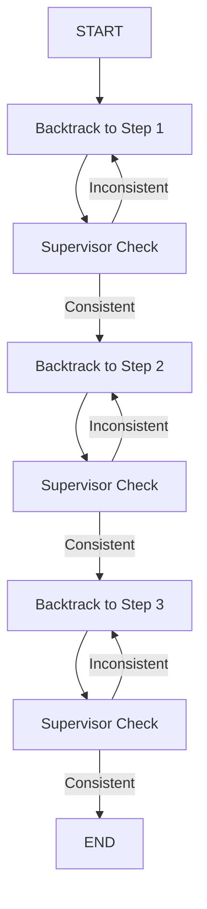
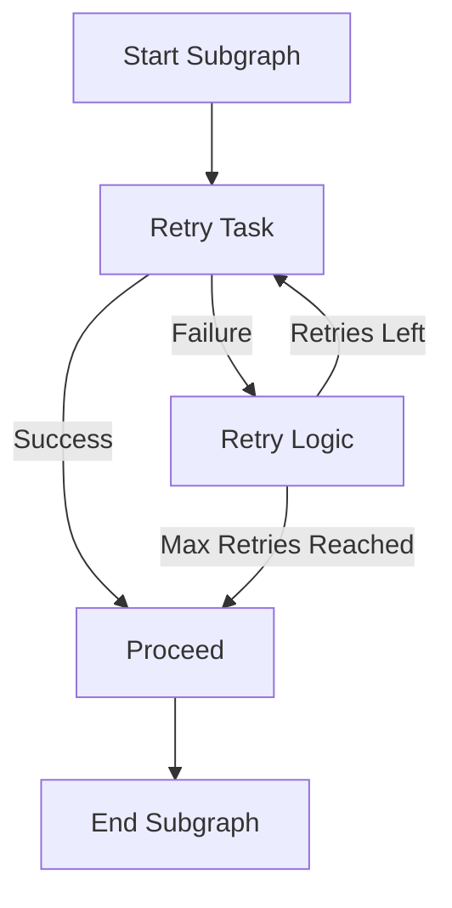

# Ad Project: Subgraphs with Retry and Supervisor Logic

This project demonstrates a LangGraph-based workflow with retry loops in subgraphs, backtracking logic, and a supervisor node that ensures consistency across steps.

## Workflow Overview

The workflow consists of three main steps, each running a subgraph that can retry tasks in case of failure. A supervisor checks the consistency of each step, and if inconsistencies are found, the workflow backtracks to reprocess the relevant step.

### Main Graph


# Subgaph with Retry Logic  


## Supervisor and Backtracking Logic

```
graph TD
    S1[Supervisor Node] --> C1[Check Consistency]
    C1 -->|Inconsistent| B1[Backtrack to Previous Step]
    C1 -->|Consistent| N1[Proceed to Next Step]
```