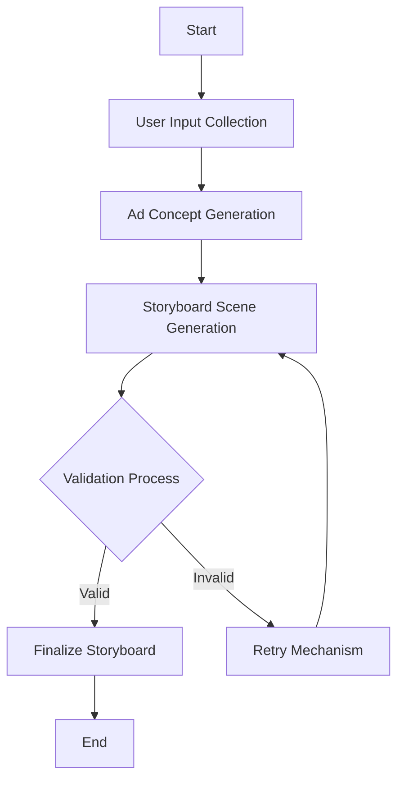

### 1. **A: Ad Storyboard Design Agent**

#### **Overview**:
The Ad Storyboard Design Agent automates the creation of ad storyboards for platforms like TikTok, Instagram, and Facebook. It uses AI technologies such as GPT-4, Few-Shot Learning, and ReACT to generate, validate, and refine ad concepts, ensuring they meet platform-specific guidelines and user-defined themes.

#### **Objectives**:
- Automate storyboard creation.
- Ensure compliance with platform guidelines.
- Enhance creativity using AI-driven approaches.

#### **Objective**:
The **Ad Storyboard Design Agent** is designed to revolutionize the creation of ad storyboards by automating the process for various digital platforms such as TikTok, Instagram, and Facebook. This agent leverages cutting-edge AI technologies, including **Large Language Models (LLMs)** like **GPT-4**, **Few-Shot Learning**, **ReACT (Reasoning and Acting)**, and **.txt Outlines** to deliver high-quality, platform-specific outputs. The agent's primary responsibilities encompass generating multi-scene ad concepts, validating these concepts, managing retries upon validation failures, and ensuring compliance with platform-specific guidelines and user-defined themes.

#### **Detailed Task Description**:
The task involves developing a sophisticated system capable of generating, validating, and refining ad storyboards. This system should adeptly interpret user inputs, generate creative content, and ensure that the content adheres to specific criteria. The process is meticulously divided into several key steps, each managed by a specialized agent.

#### **Task Breakdown and Workflow**:
1. **User Input Collection**:
   - **Agent**: `RequestRewriterAgent`
   - **Task**: Transform user inputs into the expected format.
   - **Approach**: Uses LangGraph for input validation.
   - **Data Flow**:
     ```mermaid
     graph TD;
         A[User Input] --> B[RequestRewriterAgent];
         B --> C[Validated Input];
     ```

2. **Ad Concept Generation**:
   - **Agent**: `GenerateAdConceptAgent`
   - **Task**: Develop a high-level ad concept.
   - **Approach**: Utilizes Few-Shot Learning with GPT-4.
   - **Data Flow**:
     ```mermaid
     graph TD;
         C[Validated Input] --> D[GenerateAdConceptAgent];
         D --> E[Ad Concept];
     ```

3. **Storyboard Scene Generation**:
   - **Agent**: `StoryboardGenerationAgent`
   - **Task**: Decompose the ad concept into scenes.
   - **Data Flow**:
     ```mermaid
     graph TD;
         E[Ad Concept] --> F[StoryboardGenerationAgent];
         F --> G[Scenes];
     ```

4. **Validation Process**:
   - **Agent**: `ValidateStoryboardAgent`
   - **Task**: Validate scenes against criteria.
   - **Data Flow**:
     ```mermaid
     graph TD;
         G[Scenes] --> H[ValidateStoryboardAgent];
         H --> I{Validation Result};
     ```

5. **Retry Mechanism**:
   - **Agent**: `RetryAgent`
   - **Task**: Correct and regenerate invalid scenes.
   - **Data Flow**:
     ```mermaid
     graph TD;
         I{Validation Result} -- Invalid --> J[RetryAgent];
         J --> F;
         I -- Valid --> K[Finalize Storyboard];
     ```
1. **User Input Collection**: Accurately gather necessary inputs from the user, such as ad theme, platform, and duration.
   - **Agent Name**: `RequestRewriterAgent`
     - **Task**: Transform user inputs into the expected format for processing.
     - **Approach**: Uses LangGraph to ensure inputs meet platform-specific requirements and constraints.
2. **Ad Concept Generation**: Develop a high-level concept for the ad based on user inputs.
3. **Storyboard Scene Generation**: Decompose the ad concept into detailed scenes.
4. **Validation Process**: Rigorously ensure each scene meets predefined criteria.
5. **Retry Mechanism**: Efficiently correct and regenerate any scenes that fail validation.

#### **Approaches and Techniques**:
- **Rule-Based Approach**: Utilize predefined rules and templates to generate ad content. This approach is straightforward but may lack creativity.
- **AI-Driven Approach**: Harness AI models like GPT-4 to generate content. This allows for enhanced creativity and adaptability but requires meticulous prompt engineering and validation.
- **Hybrid Approach**: Integrate rule-based and AI-driven methods to balance creativity and control.

#### **Comprehensive Workflow**:


- **Start**: Initiates the process.
- **User Input Collection**: Gathers and validates user inputs.
- **Ad Concept Generation**: Creates a high-level concept.
- **Storyboard Scene Generation**: Breaks down the concept into scenes.
- **Validation Process**: Ensures scenes meet criteria.
- **Retry Mechanism**: Regenerates invalid scenes.
- **End**: Finalizes the storyboard.

#### **Input and Output Data Structures**:
- **User Input**:
  ```json
  {
    "ad_theme": "Winter clothing sale",
    "platform": "TikTok",
    "ad_duration": 30
  }
  ```

- **Generated Scene**:
  ```json
  {
    "scene": {
      "headline": "Winter Escape",
      "description": "A woman steps out into the snow wearing the new winter collection coat. The camera zooms in on the intricate details of the coat's design.",
      "visual_element": "Close-up of coat details"
    }
  }
  ```

- **Validation Feedback**:
  ```json
  {
    "status": "invalid",
    "errors": [
      {
        "field": "headline",
        "message": "Headline exceeds maximum length."
      }
    ]
  }
  ```
- **Generated Scene**:
  ```json
  {
    "scene": {
      "headline": "Winter Escape",
      "description": "A woman steps out into the snow wearing the new winter collection coat. The camera zooms in on the intricate details of the coat's design.",
      "visual_element": "Close-up of coat details"
    }
  }
  ```

#### **Configuration Files and Options**:
- **Platform Defaults**: A YAML file (`config/platform_defaults.yaml`) specifying platform-specific requirements such as ad duration, scene count, and validation guidelines.

- **Platform Defaults**: A YAML file (`config/platform_defaults.yaml`) specifying platform-specific requirements such as ad duration, scene count, and validation guidelines.

- **Configuration Options**:
  - **ad_duration**: Specifies the default duration of the ad in seconds. This affects the pacing and number of scenes generated.
  - **scene_count**: Defines the default number of scenes to be generated for the ad. This is based on the ad duration and platform requirements.
  - **guidelines**: A set of rules specific to each platform, including:
    - **headline_length**: Maximum character length for scene headlines.
    - **description_length**: Maximum character length for scene descriptions.

Example configuration for TikTok:
```yaml
TikTok:
  ad_duration: 15
  scene_count: 3
  guidelines:
    headline_length: 50
    description_length: 100
```

This configuration allows for easy customization of ad generation parameters to suit different platforms and their unique requirements.
- **Validation Rules**: Pydantic models or JSON schemas defining validation criteria for scenes.
The `config/platform_defaults.yaml` file contains the following configuration options for each platform:

- **ad_duration**: Specifies the default duration of the ad in seconds. This affects the pacing and number of scenes generated.
- **scene_count**: Defines the default number of scenes to be generated for the ad. This is based on the ad duration and platform requirements.
- **guidelines**: A set of rules specific to each platform, including:
  - **headline_length**: Maximum character length for scene headlines.
  - **description_length**: Maximum character length for scene descriptions.

Example configuration for TikTok:
```yaml
TikTok:
  ad_duration: 15
  scene_count: 3
  guidelines:
    headline_length: 50
    description_length: 100
```

This configuration allows for easy customization of ad generation parameters to suit different platforms and their unique requirements.
- **Validation Rules**: Pydantic models or JSON schemas defining validation criteria for scenes.

---

#### **1.1. User Input Collection and Processing**:
The agent collects the following essential input data from the user:
- **Ad Theme**: A concise description provided by the user, such as "Winter clothing sale" or "Summer sports gear promo."
- **Platform**: The target platform for the ad storyboard, which could be TikTok, Instagram, or Facebook. Each platform has unique formats, audience preferences, and stylistic guidelines that must be adhered to.
- **Ad Duration**: The total length of the ad in seconds, which can range from 0 to 60 seconds. The duration directly influences the number of scenes generated.

---

#### **1.2. Ad Concept Generation and Refinement**:
- **Agent Name**: `GenerateAdConceptAgent`
  - **Task**: Generate a high-level **ad concept** based on the user-provided theme and platform.
  - **Approach**: Employs **Few-Shot Learning** to prime GPT-4 with examples of successful ad concepts, ensuring consistent structure and tone throughout the ad.
  - **Prompt Design**:
    - The prompt includes theme and platform details, along with examples of ad concepts for similar themes. For instance, it may guide GPT-4 to focus on visually appealing, short-form content for TikTok, while emphasizing storytelling for Instagram.
    - Extensive Few-Shot Prompt Examples:
      ```markdown
      Generate a storyboard for a 15-second TikTok ad promoting winter clothing. Here are some examples:

      Example 1: "Winter Comfort": A young woman wraps herself in a cozy sweater while walking through snow-covered streets. The ad emphasizes warmth and style.

      Example 2: "Summer Vibes": A group of friends enjoy a sunny day at the beach, showcasing vibrant swimwear. The ad highlights fun and relaxation.

      Example 3: "Tech Trends": A young professional uses the latest smartphone features in a bustling city. The ad focuses on innovation and connectivity.

      Example 4: "Eco Adventure": A family explores a lush forest, highlighting eco-friendly outdoor gear. The ad promotes sustainability and adventure.

      Example 5: "Fitness Goals": An athlete trains in a gym, showcasing new sports equipment. The ad emphasizes strength and determination.

      Now, create a similar concept based on the theme "Winter clothing sale."
      ```

  - **ReACT Prompt Design and Error Handling**:
    - The ReACT prompts are designed to handle validation errors and retry logic:
      ```markdown
      If the scene headline is too long, suggest a shorter alternative that maintains the key message. For example, if the headline is "Experience the Ultimate Winter Comfort with Our New Collection," suggest "Ultimate Winter Comfort."

      If the description lacks detail, add specific elements such as colors, emotions, or actions. For example, "A woman walks through snow" could be expanded to "A woman in a red coat walks through a snowy park, smiling as snowflakes fall."

      If the visual element is missing, suggest a relevant visual that enhances the scene. For example, "Add a close-up of the product logo on the coat."
      ```

  - **Example of Integration**:
    - The storyboard generation process should seamlessly integrate these prompts to ensure high-quality outputs. For instance, after generating an initial concept, the system should validate it against platform guidelines and use ReACT prompts to refine any issues.
    - **Feedback Loop**: Incorporate user feedback to iteratively improve the storyboard. If a user suggests changes, the system should adapt and regenerate the storyboard accordingly.

#### **Conditions, Error Handling, and Feedback Loops**:
- **Validation Errors**: If a scene fails validation, detailed error messages are generated to guide corrections.
- **Retry Logic**: The system uses ReACT to intelligently adjust and retry failed scenes, ensuring efficient error correction.
- **Feedback Loop**: Incorporate user feedback to iteratively improve the storyboard. If a user suggests changes, the system should adapt and regenerate the storyboard accordingly.
- **Validation Errors**: If a scene fails validation, detailed error messages are generated to guide corrections.
- **Retry Logic**: The system uses ReACT to intelligently adjust and retry failed scenes, ensuring efficient error correction.

---

#### **1.3. Storyboard Scene Generation and Detailing**:
- **Agent Name**: `StoryboardGenerationAgent`
  - **Task**: Break down the ad concept into multiple scenes, each of which consists of:
    1. **Headline**: A short, punchy title that introduces the scene.
    2. **Description**: A detailed breakdown of the visual and narrative elements of the scene.
    3. **Visual Element**: An optional field describing any specific visuals required (e.g., product close-ups, logo placements).
  - **Scene Count**: The number of scenes is determined by the **ad duration**:
    - For ads under 10 seconds, the agent generates 3 scenes.
    - For 30-second ads, it generates 5 scenes.
    - For 60-second ads, it generates 7 scenes.
  - **Output Format**:
    ```json
    {
      "scene": {
        "headline": "Winter Escape",
        "description": "A woman steps out into the snow wearing the new winter collection coat. The camera zooms in on the intricate details of the coat's design.",
        "visual_element": "Close-up of coat details"
      }
    }
    ```

---

#### **1.4. Validation Process and Criteria**:
- **Agent Name**: `ValidateStoryboardAgent`
  - **Task**: Validate each generated scene against predefined rules using **Pydantic models**. This includes ensuring that all necessary fields (headline, description, and visual element) are correctly populated and adhere to the platform's length and style requirements.
  - **Validation Criteria**:
    - **Headline**: Must be between 3 and 50 characters, should be in title case, and non-empty.
    - **Description**: Must be detailed, contain at least 10 words, and fully describe the scene.
    - **Visual Element**: Optional, but if provided, should describe a specific visual component (e.g., product close-ups, brand logo).
  - **Error Handling**: If validation fails, verbose error messages are returned to GPT-4 for correction.

---

#### **1.5. Retry Mechanism and Optimization**:
- **Agent Name**: `RetryAgent`
  - **Task**: Automatically retry generating only the invalid scenes based on the verbose error messages returned by the validation agent.
  - **Error Messages**: These messages are structured to be fed back into GPT-4 for corrections.
    - Example:
      ```json
      {
        "loc": ["scenes", 2, "headline"],
        "msg": "The headline cannot be empty. It should summarize the scene's key focus."
      }
      ```
  - **ReACT Integration**: The agent uses **ReACT** to reason through the failed validation and generate a correction, rather than simply retrying without adjustment.

