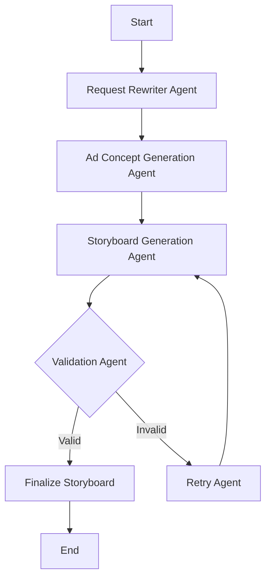

# Agent Specifications

## Detailed Overview

This document outlines the specifications for the agents involved in the Ad Storyboard Design process. It includes the workflow, data structures, and validation mechanisms.

## Comprehensive Workflow

The workflow for the Ad Storyboard Design process is designed to ensure a seamless transition from user input to final storyboard output. Each agent plays a critical role in transforming raw data into a polished ad storyboard. The process is iterative, allowing for continuous refinement based on user feedback and validation results.



## Agents and Their Roles

### Request Rewriter Agent

The Request Rewriter Agent is the first point of contact in the workflow. It is responsible for transforming user inputs into a structured format that can be easily processed by subsequent agents. This agent ensures that all inputs are complete, consistent, and adhere to platform-specific requirements.

- **Detailed Functionality**:
  - **Input Parsing**: Breaks down user inputs into manageable components, identifying key elements such as ad theme, platform, and duration.
  - **Data Standardization**: Converts inputs into standardized formats, such as date and time formats, to ensure compatibility with downstream processes.
  - **Error Detection**: Identifies and flags incomplete or incorrect inputs, prompting users for corrections.
  - **User Guidance**: Provides real-time feedback and suggestions to users, helping them refine their inputs for better results.

- **Task**: Transform user inputs into the expected format, ensuring compatibility with downstream processes.
- **Approach**: Utilizes **LangGraph** to enforce platform-specific requirements and constraints, enhancing input reliability and consistency. It formats dates, quantities, and standardizes text to ensure that the input data adheres to expected formats for downstream processing. The agent also supports chat-based editing for user feedback and adjustments.

- **User Interaction**: The agent guides users through a series of steps to refine inputs, ensuring clarity and completeness. Users can provide feedback at each stage, request changes, and receive suggestions for improving input quality. This interaction is designed to be intuitive, with prompts and examples to assist users in making informed decisions.

### Ad Concept Generation Agent

The Ad Concept Generation Agent is tasked with creating a high-level concept for the ad based on user inputs. This agent leverages advanced AI techniques to generate creative and contextually relevant ad concepts.

- **Detailed Functionality**:
  - **Creative Ideation**: Uses Few-Shot Learning with GPT-4 to generate innovative ad concepts that align with user themes and platform guidelines.
  - **Iterative Refinement**: Incorporates user feedback to refine ad concepts, ensuring they meet user expectations and platform standards.
  - **Concept Validation**: Ensures that generated concepts are feasible and align with the overall ad strategy.

- **Task**: Generate a high-level ad concept that aligns with user themes and platform guidelines.
- **Approach**: Leverages Few-Shot Learning with GPT-4 to produce creative and contextually relevant ad concepts, incorporating user feedback for iterative improvement.

### Storyboard Generation Agent

The Storyboard Generation Agent is responsible for breaking down the ad concept into detailed scenes. Each scene is crafted to contribute to a compelling narrative that engages the target audience.

- **Detailed Functionality**:
  - **Scene Development**: Decomposes the ad concept into distinct scenes, each with a clear purpose and message.
  - **Narrative Coherence**: Ensures that all scenes flow logically and contribute to the overall storyline.
  - **Engagement Optimization**: Designs scenes to maximize viewer engagement, using techniques such as emotional appeal and visual storytelling.

- **Task**: Decompose the ad concept into detailed, coherent scenes that form a compelling narrative.
- **Approach**: Ensures each scene is distinct yet contributes to the overall ad storyline, optimizing for engagement and clarity.

### Validation Agent

The Validation Agent plays a crucial role in ensuring that each generated scene complies with predefined rules and platform standards. This agent uses robust validation techniques to identify and correct errors.

- **Detailed Functionality**:
  - **Rule Enforcement**: Applies Pydantic models to validate scene elements, such as headline length and description detail.
  - **Error Reporting**: Provides detailed error messages to guide corrections, helping users refine their inputs.
  - **Compliance Assurance**: Ensures that all scenes meet platform-specific guidelines, such as content restrictions and format requirements.

- **Task**: Validate each generated scene to ensure compliance with predefined rules and platform standards.
- **Approach**: Employs Pydantic models for robust validation, providing detailed error messages to facilitate correction and refinement.

### Retry Agent

The Retry Agent is designed to handle scenes that fail validation. It intelligently adjusts and regenerates scenes based on detailed error messages, minimizing errors and enhancing output quality.

- **Detailed Functionality**:
  - **Error Analysis**: Analyzes validation errors to identify root causes and suggest targeted corrections.
  - **Scene Regeneration**: Uses ReAct to intelligently adjust and regenerate scenes, ensuring they meet validation criteria.
  - **Efficiency Optimization**: Minimizes the need for manual intervention by automating the correction process.

- **Task**: Retry generating invalid scenes, leveraging detailed error messages for targeted corrections.
- **Approach**: Integrates with **ReAct** to intelligently adjust and regenerate scenes, minimizing errors and enhancing output quality.

## Data Structures and Validation

### UserInput

```python
from pydantic import BaseModel, validator, ValidationError

class UserInput(BaseModel):
    ad_theme: str
    platform: str
    ad_duration: int

    @validator('ad_duration')
    def check_duration(cls, value):
        if not (0 <= value <= 60):
            raise ValueError('Ad duration must be between 0 and 60 seconds. Please adjust your input accordingly.')
        return value

    @validator('platform')
    def check_platform(cls, value):
        valid_platforms = ['tiktok', 'instagram', 'facebook']
        if value.lower() not in valid_platforms:
            raise ValueError('Platform must be TikTok, Instagram, or Facebook. Please select a valid platform.')
        return value.title()

    @property
    def is_fixed_image(self):
        """
        Determines if the ad is a fixed image based on the ad_duration.
        """
        return self.ad_duration == 0
```

**Note**: An `ad_duration` of `0` seconds indicates a fixed image ad.

### Scene

```python
from pydantic import BaseModel, validator, Field

class Scene(BaseModel):
    headline: str = Field(..., min_length=3, max_length=50)
    description: str
    visual_element: str = None

    @validator('description')
    def check_description_length(cls, value):
        if len(value.split()) < 10:
            raise ValueError('Description must contain at least 10 words. Please provide a more detailed description.')
        return value
```

## Error Handling and Feedback

- **Verbose Error Messages**: Each validation error provides detailed feedback to guide corrections.
- **Retry Mechanism**: Uses error messages to adjust and retry failed scenes.
