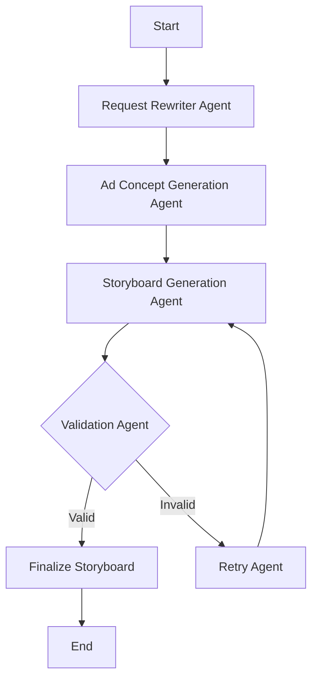

# Agent Specifications

## Detailed Overview

This document outlines the specifications for the agents involved in the Ad Storyboard Design process. It includes the workflow, data structures, and validation mechanisms.

## Comprehensive Workflow



## Agents and Their Roles

### Request Rewriter Agent

- **Task**: Transform user inputs into the expected format, ensuring compatibility with downstream processes.
- **Approach**: Utilizes LangGraph to enforce platform-specific requirements and constraints, enhancing input reliability and consistency.

### Ad Concept Generation Agent

- **Task**: Generate a high-level ad concept that aligns with user themes and platform guidelines.
- **Approach**: Leverages Few-Shot Learning with GPT-4 to produce creative and contextually relevant ad concepts, incorporating user feedback for iterative improvement.

### Storyboard Generation Agent

- **Task**: Decompose the ad concept into detailed, coherent scenes that form a compelling narrative.
- **Approach**: Ensures each scene is distinct yet contributes to the overall ad storyline, optimizing for engagement and clarity.

### Validation Agent

- **Task**: Validate each generated scene to ensure compliance with predefined rules and platform standards.
- **Approach**: Employs Pydantic models for robust validation, providing detailed error messages to facilitate correction and refinement.

### Retry Agent

- **Task**: Retry generating invalid scenes, leveraging detailed error messages for targeted corrections.
- **Approach**: Integrates with ReACT to intelligently adjust and regenerate scenes, minimizing errors and enhancing output quality.

## Data Structures and Validation

### UserInput

```python
from pydantic import BaseModel, validator, ValidationError

class UserInput(BaseModel):
    ad_theme: str
    platform: str
    ad_duration: int

    @validator('ad_duration')
    def check_duration(cls, value):
        if not (0 <= value <= 60):
            raise ValueError('Ad duration must be between 0 and 60 seconds. Please adjust your input accordingly.')
        return value

    @validator('platform')
    def check_platform(cls, value):
        if value not in ['TikTok', 'Instagram', 'Facebook']:
            raise ValueError('Platform must be TikTok, Instagram, or Facebook. Please select a valid platform.')
        return value
```

### Scene

```python
class Scene(BaseModel):
    headline: str
    description: str
    visual_element: str = None

    @validator('headline')
    def check_headline_length(cls, value):
        if not (3 <= len(value) <= 50):
            raise ValueError('Headline must be between 3 and 50 characters. Please revise your headline.')
        return value

    @validator('description')
    def check_description_length(cls, value):
        if len(value.split()) < 10:
            raise ValueError('Description must contain at least 10 words. Please provide a more detailed description.')
        return value
```

## Error Handling and Feedback

- **Verbose Error Messages**: Each validation error provides detailed feedback to guide corrections.
- **Retry Mechanism**: Uses error messages to adjust and retry failed scenes.
