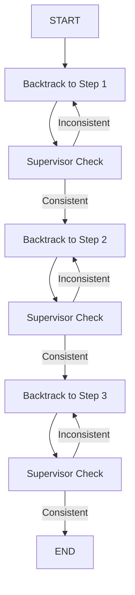
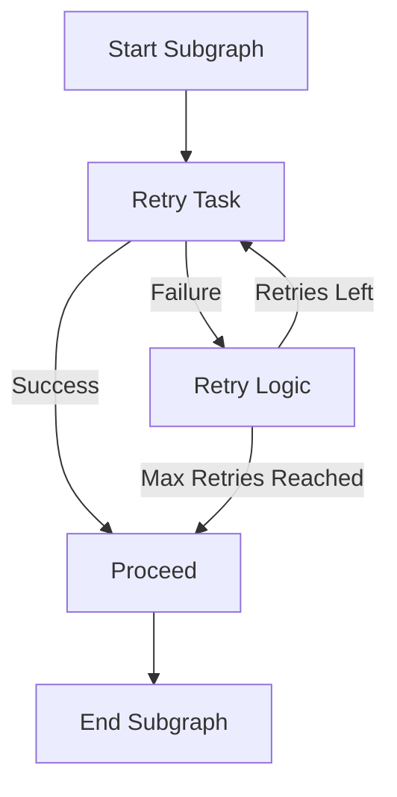
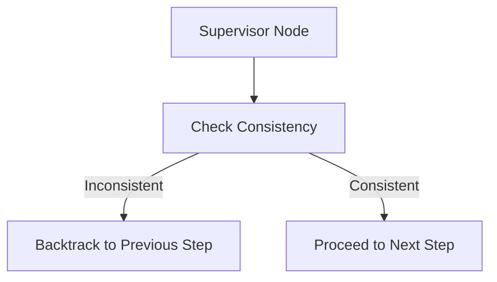

## Workflow Description

To design the ads, we'll use a simple **three-step LangGraph workflow** where each step contains a **subgraph** with retry loops.
Additionally, the workflow includes a **supervisor node** that ensures consistency across the steps.

If an inconsistency is detected in the subgraph's results, the supervisor triggers a **backtracking mechanism** to reprocess that step.

### Key Features:
1. **Three-Step Main Graph**: The workflow is divided into three steps, each invoking a subgraph responsible for performing a task.
2. **Retry Loops**: Each subgraph contains retry logic to retry a task a specified number of times if the task fails.
3. **Supervisor Node**: After each step, a supervisor checks the consistency of the subgraph's results. If the results are inconsistent, the workflow backtracks to the inconsistent step.
4. **Backtracking**: The supervisor dynamically controls the workflow and backtracks to the specific step that produced inconsistent results.

---

## Workflow Diagrams

### 1. **Main Graph Workflow**

- **Step 1**: Executes the subgraph for the first step, stores the result, and passes it to the supervisor.
- **Supervisor Check**: Verifies if the result of Step 1 is consistent. If inconsistent, it backtracks and reruns Step 1.
- **Step 2**: Executes the subgraph for Step 2, stores the result, and repeats the consistency check with the previous step.
- **Step 3**: Similar to the previous steps, it executes Step 3's subgraph, and the supervisor ensures consistency across all three steps.
- **End**: If all steps are consistent, the workflow completes.

---

### 2. **Subgraph Workflow with Retry Logic**

- **Task Step**: Performs the core operation. If successful, it proceeds to the next step in the subgraph.
- **Retry Logic**: If the task fails, it checks if the retry count is below the threshold. If retries are left, it retries the task. If max retries are reached, it proceeds to the next step regardless of success.
- **Next Step**: Proceeds after retries are either exhausted or the task succeeds.

---

## Backtracking and Supervisor Logic

The **supervisor node** is responsible for ensuring that each step is consistent with the others. If any step produces a result that is inconsistent with the previous steps, the supervisor triggers a backtrack to the step where the issue originated. The backtracking logic reruns the subgraph for the identified step until consistency is achieved.

### Supervisor Logic:

The supervisor runs after each step, checking the results of the current step against the previous steps. If inconsistencies are found, it triggers a backtrack to the previous step for reprocessing.

---

## How It Works

1. **Initialization**: The workflow starts at **Step 1**, executing its subgraph and storing the result.
2. **Supervisor Check**: After Step 1, the **Supervisor** checks if the result is consistent. If so, the workflow proceeds to Step 2. Otherwise, the workflow backtracks and reruns Step 1.
3. **Retry Mechanism**: Each step’s subgraph includes retry logic. If a task fails, the subgraph attempts the task again until the retry limit is reached.
4. **Backtracking**: If any step’s result is inconsistent, the **Supervisor** resets the state for that step and reprocesses it. This ensures that all steps produce consistent results before the workflow proceeds.
5. **Completion**: Once all steps are processed and the results are consistent, the workflow completes successfully.

---

## Conclusion

This workflow implements a robust system for handling multi-step processes where each step depends on the successful completion of the previous ones. By incorporating retry logic and a supervisor node, the workflow can handle failures, backtrack when necessary, and ensure the consistency of the final result.

