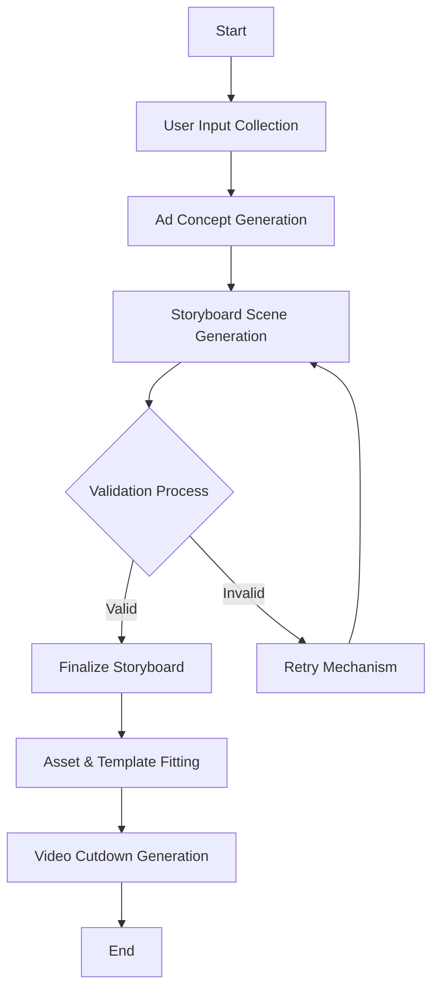

# Overall Workflow Diagram

This diagram illustrates the end-to-end process of ad creation, from initial user input to final video cutdown generation. It highlights the key stages involved in transforming raw inputs into polished advertisements, ensuring that each step is logically connected and validated. The workflow leverages advanced AI techniques and robust validation mechanisms to maintain high quality and compliance with platform-specific guidelines.
